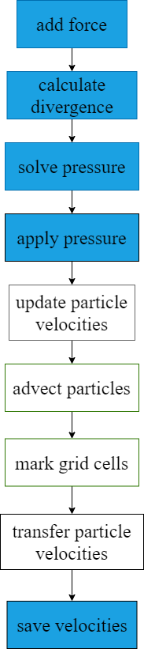

FLIP solver using multigrid preconditioned CG
=====

The solver is a basic Fluid-Implicit-Particles (FLIP) / Particle-In-Cell (PIC) solver **[1]**, using multigrid preconditioned conjugate gradient (MGPCG) for pressure solving. The MGPCG solver is modified from Taichi's example *mgpcg_advanced.py*, to use the method in **[2]** for simulating free-surface fluids.

Free-surface means that the "liquid" has a boundary with a free space where "air" is supposed to be. The free space enforces zero pressure and allows the fluid to move freely.

The method is hybrid, using both grid and particle representations for efficient pressure solve and low-dissipation advection. In each timestep, the following operations are carried out, where blue marks grid-based operations and white marks particle-based operations.

There are some details that may be most useful:

- Pressure boundary conditions, that $P_{air}=0$ and $P_{solid}=P_{fluid}$ must be handled correctly in the pressure solver implementation. 

- Velocity extrapolation is necessary. To make it work, velocity at the air-liquid surface must be updated using the solved pressure and used for extrapolation.

- some of the steps may be reordered, but the advection step must use divergence-free velocity field, or volume loss is expected.

[1] [Animating sand as a fluid](https://www.cs.ubc.ca/~rbridson/docs/zhu-siggraph05-sandfluid.pdf)

[2] [A parallel multigrid Poisson solver for fluids simulation on large grids](https://www.math.ucla.edu/~jteran/papers/MST10.pdf)